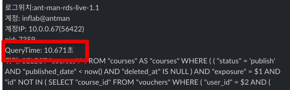

# NodeJS 와 PostgreSQL Query Timeout

작은 서비스를 운영할때는 큰 문제가 없으나, 조금씩 데이터가 적재되고나서는 점점 슬로우 쿼리가 등장하게 됩니다.  



이때 쿼리 시간을 제한하지 않으면, **5분/10분씩 수행되는 쿼리가 운영 환경에서 실행**하게 되기도 하는데요.  
이런 쿼리가 트래픽에 맞춰 여러개 요청이 온다면 결국 Node에서 사용가능한 Connection Pool이 가득차 더이상 쿼리 질의를 못하거나, 심한 경우 데이터베이스의 장애로 확장되기도 합니다.  
그래서 적정시간 이상으로 쿼리가 수행되면 **강제로 종료**하고, 다시 요청하도록 하는것이 일반적인 방식인데요.  
해당 상황과 PostgreSQL에서의 옵션에 대해 소개드립니다.

## 실험 환경

아래 환경에서 실험하겠습니다.

* Node 16
* PostgreSQL 14 (by Docker)

**app.js**

```javascript
const express = require('express');
const pg = require('pg');

const app = express()
const port = 3000

const client = new pg.Pool({
  host: 'localhost',
  user: 'test',
  password: 'test',
  database: 'test',
  port: 5432,
})

client.connect(err => {
  if (err) {
    console.log('Failed to connect db ' + err)
  } else {
    console.log('Connect to db done!')
  }
})

app.get('/', (req, res) => {
  res.send('Hello World!')
});

app.get('/test-timeout', async (req, res) => {
  const start = new Date();
  try {
    await client.query('SELECT pg_sleep(3);');
    const lag = new Date() - start;
    console.log(`Lag: \t${lag} ms`);
  } catch (e) {
    const lag = new Date() - start;
    console.log(`Lag: \t${lag} ms`);
    console.error('pg error', e);
  }

  res.send('test-timeout!');
});

app.listen(port, () => {
  console.log(`Example app listening at http://localhost:${port}`)
});
```


## 테스트

```bash
b -n 300 -c 30 -s 600 http://localhost:3000/test-timeout/
```

만약 이런 3초짜리 요청이 **MaxConnection 수 만큼 온다면**, 이 3초동안은 더이상 Database에 쿼리를 날릴수가 없는 상태가 됩니다.    

## statement_timeout

PostgreSQL에서는 QueryTimeout 옵션을 `statement_timeout` 으로 설정할 수 있습니다.  
Express와 `pg` 모듈만 사용중이시라면 아래와 같이 connection Option에서 

```javascript
const client = new pg.Pool({
  statement_timeout: 1000,
})
```

만약 **TypeORM을 사용**하신다면, 아래와 같이 `extra` 항목에 추가해서 설정할 수 있습니다.

```javascript
  return TypeOrmModule.forRoot({
    maxQueryExecutionTime: dbEnv.connectionTimeout,
    extra: {
      statement_timeout: dbEnv.connectionTimeout,
      ...
    },
    ...
  });
```

* `maxQueryExecutionTime` 는 **타임아웃 설정이 아닙니다**
  * [공식문서](https://github.com/typeorm/typeorm/blob/master/docs/logging.md#log-long-running-queries) 에 나와있듯이, **이 시간이 지나면 롱쿼리 로그를 남기겠다**의 옵션입니다.
  * 오해하시면 안되며, 타임아웃 설정은 `extra.statement_timeout` 로 하셔야 합니다.

## 타임아웃 테스트


