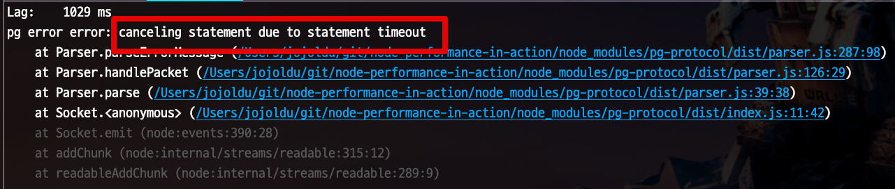

# NodeJS 와 PostgreSQL Query Timeout

## 실험 환경

```javascript

```
## 기본 설정

```bash
b -n 300 -c 30 -s 600 http://localhost:3000/test-timeout/
```

3초 짜리 
## statement_timeout


```bash
const client = new pg.Pool({
  statement_timeout: 1000,
})
```




