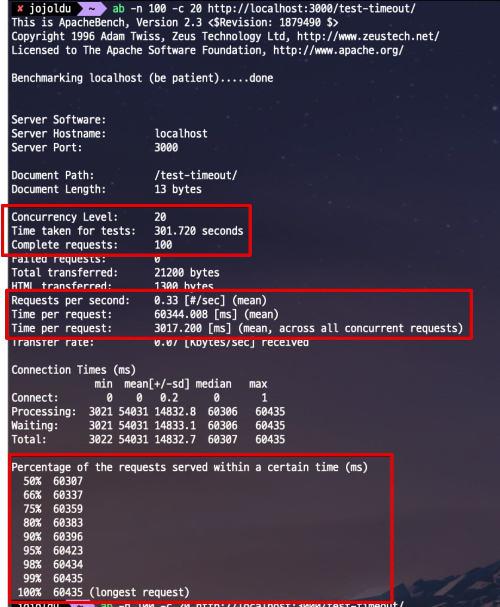

# NodeJS 와 PostgreSQL Connection Pool

Database에 관해 기본적인 id/pw만 설정해서는 전체 

## 1. 실험 환경

실험의 경우 아래 환경에서 진행합니다.

* Node 16
* PostgreSQL 14 (by Docker)

간단하게 아래와 같이 Node와 PG를 사용한 코드를 하나 만들어둡니다.

> lint 등을 빼고 실험을 위해 빠르게 구성했습니다.

**app.js**

```javascript
const express = require('express');
const pg = require('pg');

const app = express()
const port = 3000

const client = new pg.Pool({
  host: 'localhost',
  user: 'test',
  password: 'test',
  database: 'test',
  port: 5432,
  min: 5,
  max: 50,
})

client.connect(err => {
  if (err) {
    console.log('Failed to connect db ' + err)
  } else {
    console.log('Connect to db done!')
  }
})

app.get('/', (req, res) => {
  res.send('Hello World!')
});

app.get('/test-timeout', async (req, res) => {
  const start = new Date();
  try {
    await client.query('SELECT pg_sleep(3);');
    const lag = new Date() - start;
    console.log(`Lag: \t${lag} ms`);
  } catch (e) {
    const lag = new Date() - start;
    console.log(`Lag: \t${lag} ms`);
    console.error('pg error', e);
  }

  res.send('test-timeout!');
});

app.listen(port, () => {
  console.log(`Example app listening at http://localhost:${port}`)
});
```

> 모든 코드는 [Github](https://github.com/jojoldu/node-performance-in-action)에 있습니다.

아주 간단한 코드입니다.

* API 호출시 강제로 3초의 쿼리를 발생시키고 (`await client.query('SELECT pg_sleep(3);');`)
* 실제로 3초의 시간만 수행 되었는지 로그로 출력 (`const lag = new Date() - start;`)

## 2. 테스트

일정 트래픽을 몰아주기 위해서 테스트는 [Apache Bench](https://httpd.apache.org/docs/2.4/ko/programs/ab.html) 를 통해 진행합니다.

> **Mac**을 사용하는 경우엔 ApacheBench 가 기본적으로 설치되어있습니다.  
> 설치여부를 확인하기 위해서 `ab -v` 로 확인해보면 됩니다.

Node와 PostgreSQL (Docker)를 실행한 뒤, 아래명령어를 터미널에 입력합니다.

```bash
ab -n 100 -c 20 http://localhost:3000/test-timeout/
```

* `-n 100`
  * 총 요청 횟수입니다.
  * 요청 사용자들이 다합쳐서 보낼 회수입니다.
* `-c 20`
  * 총 요청자들의 수 입니다.
  * 20명의 동시 사용자가 요청합니다.

이렇게 요청하시면 다음과 같은 결과를 얻을 수 있습니다.




* 이 테스트는 **20명의 동시 사용자로 총 100번을 호출**했다
* 요청당 평균 시간
  * `Time per request` 의 첫번째 값
  * 이 요청은 60344 ms, 즉 평균 60초가 요청되었다
* 예상되는 평균 응답시간
  * `Percentage of the requests served...` 항목
  * 60307ms ~ 60435ms 로 응답한다
* 초당 요청
  * `Request per second` 항목
  * 1초에 최대 요청양을 이야기한다.
  * 현재 0.33 인데, 이는 **1초에 1건도 처리 못한다**는 것을 의미한다.


```bash
ab -n 1000 -c 15 -s 600 http://localhost:3000/test-timeout/
```

## 주의사항

무조건적으로 

* 우리 서비스는 nodejs 

예를 들어 MySQL의 MaxConnection 계산식은 `{DBInstanceClassMemory/12582880}` 입니다.  
그럼,

* `t2.micro` RDS를 사용한다면
  * `t2.micro` 의 메모리는 512MB이니,
  * max_connections 은 `(512*1024*1024)/12582880` 가 되어 **40개**의 MaxConnection RDS에서 설정됩니다.

즉, `t2.micro` 는 Node Application & 개별 DB Gui 도구까지 합쳐서 40개의 커넥션 이상은 동시에 연결될 수 없습니다.  
그래서 이에 맞게 Node에서 Connection Option에서 적절한 수치의 `connectionLimit` 을 설정해야만 합니다.

자세한 RDS의 MaxConnection 계산식은 [공식문서](https://docs.aws.amazon.com/ko_kr/AmazonRDS/latest/UserGuide/CHAP_Limits.html#RDS_Limits.MaxConnections) 를 참고하면 좋습니다.

