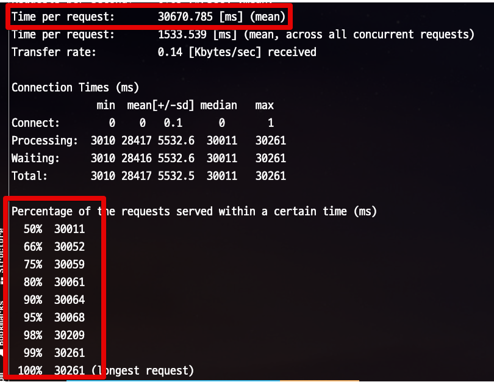

# NodeJS 와 PostgreSQL Connection Pool

Database에 관해 기본적인 id/pw 외에 해야할 설정들이 여러개 있는데요.  
그 중 실제 서비스 운영에 가장 중요한 설정 중 하나가 이전 글인 [쿼리 타임아웃](https://jojoldu.tistory.com/631) 과 함께 커넥션 풀 (Connection Pool) 설정입니다.  
  
이 커넥션풀 설정이 왜 필요한지, 어떻게 해야할지 등등을 알아보겠습니다.

## 1. 실험 환경

실험의 경우 아래 환경에서 진행합니다.

* Node 16
* PostgreSQL 14 (by Docker)

간단하게 아래와 같이 Node와 PG를 사용한 코드를 하나 만들어둡니다.

> 실험을 위해 lint 등을 빼고 빠르게 구성했습니다.

**app.ts**

```javascript
const express = require('express');
const pg = require('pg');

const app = express()
const port = 3000

const client = new pg.Pool({
  host: 'localhost',
  user: 'test',
  password: 'test',
  database: 'test',
  port: 5432,
  max: 5,
})

client.connect(err => {
  if (err) {
    console.log('Failed to connect db ' + err)
  } else {
    console.log('Connect to db done!')
  }
})

app.get('/', (req, res) => {
  res.send('Hello World!')
});

app.get('/test-timeout', async (req, res) => {
  const start = new Date();
  try {
    await client.query('SELECT pg_sleep(3);');
    const lag = new Date() - start;
    console.log(`Lag: \t${lag} ms`);
  } catch (e) {
    const lag = new Date() - start;
    console.log(`Lag: \t${lag} ms`);
    console.error('pg error', e);
  }

  res.send('test-timeout!');
});

app.listen(port, () => {
  console.log(`Example app listening at http://localhost:${port}`)
});
```

> 모든 코드는 [Github](https://github.com/jojoldu/node-performance-in-action)에 있습니다.

아주 간단한 코드입니다.

* API 호출시 강제로 3초의 쿼리를 발생시키고 (`await client.query('SELECT pg_sleep(3);');`)
* 실제로 3초의 시간만 수행 되었는지 로그로 출력 (`const lag = new Date() - start;`)

여기서 핵심은 바로 아래와 같이 `pool` 의 `max: 5` 설정입니다.

```javascript
const client = new pg.Pool({
  host: 'localhost',
  user: 'test',
  password: 'test',
  database: 'test',
  port: 5432,
  max: 5,
})
```

이렇게 하면 **최대 커넥션 생성 개수가 5로 설정**됩니다.  

> `max` 의 기본값은 **10**입니다.  

max (maxConnection: 최대 커넥션수)를 5로 하게 되면 어떻게 될까요?

## 2. 테스트

일정 트래픽을 몰아주기 위해서 테스트는 [Apache Bench](https://httpd.apache.org/docs/2.4/ko/programs/ab.html) 를 통해 진행합니다.

> **Mac**을 사용하는 경우엔 ApacheBench 가 기본적으로 설치되어있습니다.  
> 설치여부를 확인하기 위해서 `ab -v` 로 확인해보면 됩니다.

Node와 PostgreSQL (Docker)를 실행한 뒤, 아래명령어를 터미널에 입력합니다.

```bash
ab -n 100 -c 20 http://localhost:3000/test-timeout/
```

* `-n 100`
  * 총 요청 횟수입니다.
  * 요청 사용자들이 다합쳐서 보낼 회수입니다.
* `-c 20`
  * 총 요청자들의 수 입니다.
  * 20명의 동시 사용자가 요청합니다.

이렇게 요청하면 다음과 같은 결과를 얻을 수 있습니다.


* 이 테스트는 **20명의 동시 사용자로 총 100번을 호출**
* 요청당 평균 시간
  * `Time per request` 의 첫번째 값
  * 이 요청은 60344 ms, 즉 평균 60초가 요청
* 예상되는 평균 응답시간
  * `Percentage of the requests served...` 항목
  * 60307ms ~ 60435ms 로 응답한다
* 초당 요청
  * `Request per second` 항목
  * 1초에 최대 요청양을 이야기한다.
  * 현재 0.33 인데, 이는 **1초에 1건도 처리 못한다**는 것을 의미

이 테스트를 보면 **평균 60초의 응답시간**을 주었다는 것을 알 수 있는데요.  
**3초 쿼리**를 20명이 호출하는데, 왜 60초가 평균 응답시간이 되었을까요?  

### 커넥션 풀이란? 

커넥션 풀 (Connection Pool) 이란 간단하게 얘기하면 클라이언트 요청이 오면 connection을 주고, 처리가 끝나면 다시 connection을 반납받아 pool에 저장하는 방식을 말합니다.  
  
**데이터베이스 연결 및 데이터베이스 읽기/쓰기 작업**과 관련된 오버헤드를 줄이는 것이 주 목적인 잘 알려진 데이터베이스와 관련된 일종의 패턴입니다.  
  
일반적인 데이터베이스를 연결해서 사용하는 것을 본다면 다음과 같습니다. 

* 데이터베이스 드라이버를 사용하여 데이터베이스 커넥션 Open
* 데이터 읽기/쓰기를 위한 TCP 소켓 Open
* 소켓을 통한 데이터 읽기/쓰기
* 커넥션 Close
* 소켓 Close

데이터베이스 연결 작업은 상당히 많은 비용이 드는 일입니다.  
그래서 **가능한 최소한으로** 줄여야 합니다.  
이때 커넥션 풀링이 필요합니다.  

기존 커넥션을 재사용할 수 있도록 구성만 한다면 막대한 비용이 드는 데이터베이스 수행 비용을 효과적으로 절감할 수 있으므로 데이터베이스 기반 애플리케이션의 전체 성능이 크게 향상됩니다.  
그래서 모든 데이터베이스 기반의 애플리케이션에서는 필수로 적용된다고 보시면 됩니다.  

> 커넥션풀에 대한 자세한 설명은 Java 기반이긴 하지만, [네이버 D2 글](https://d2.naver.com/helloworld/5102792) 을 참고하면 좋습니다.  
> Node로 된 글 중에서 이정도로 자세하게 커넥션 풀에 대해 설명한 글이 없어서 부득이하게 자바로 된 글을 첨부합니다.

사용 방법은 간단합니다.  
이 예제의 코드와 같이 `pg.Pool` 로 데이터베이스 커넥션 작업을 진행하시면 됩니다.

```javascript
const client = new pg.Pool({
  host: 'localhost',
  user: 'test',
  ....
  max: 2,
})
```

### 테스트에서의 커넥션풀

이를테면 `max:4` 로 둔다면 실제 내부적으로는 다음과 같이 작동하게 됩니다.


* DB 쿼리가 필요한 요청이 **동시에 7개**가 온다면
* 최대 커넥션수 (4개)가 3초간 처리 중이 되고,
* 나머지 3개는 모두 대기 상태에 빠지게 됩니다. 

그래서 실제로 위 테스트의 Node 로그를 보면 **3초씩 지연이 누적**되는 것을 볼 수 있습니다.  
(즉, 앞의 요청을 처리하는동안 나머지 요청들은 **대기시간이 누적** 된 것입니다.)


### 최대 대기 시간

위 실험을 보고 나면 한가지 우려가 들 수 있습니다.  
동시에 요청이 1000, 2000개씩 오게 되서 다음과 같은 고민을 할 수 있습니다.

* "**커넥션을 맺기 위한 대기시간이 수십분**이 걸리면 어떡하지?"
  * 처리하지 못하고 대기하고 있는 수많은 요청들로 인해서 서버 부하와 함께 장애가 발생하는 것은 걱정이다.
* 그럴바에는 "차라리 **일정시간이상 대기하는 것들은 모두 다 취소**" 시키고, 서버의 부하를 낮추는 방향을 선택하는게 낫겠다.

와 같은 고민들이죠.  
  
그럴때는 `connectionTimeoutMillis` 설정을 사용하시면 됩니다.

```javascript
const client = new pg.Pool({
  ...
  connectionTimeoutMillis: 30000,
  max: 2,
})
```

이렇게 설정하면 **최대 커넥션 대기 시간은 30초**로 설정됩니다.

* `connectionTimeoutMillis` 의 기본값은 **무제한**입니다.
* `connectionTimeoutMillis` 의 기본 단위는 `ms` 입니다.
  
최대 커넥션 대기 시간을 30초로 설정하고, 똑같이 부하 테스트를 실행해봅니다.  
그럼 아래와 같이 **30초이상 대기가 되면 바로 취소** 됩니다.


전체 평균 응답 시간이 60초에서 30초로 단축 되는 효과도 있습니다.  
(물론 요청들의 취소건도 같이 늘었겠죠?)



## 3. 주의사항

이 실험 결과를 보고 무조건적으로 커넥션수를 높이면 되겠다고 생각하실 수도 있는데요.  
그렇지는 않습니다.  
이는 애플리케이션의 문제라기 보다는 **그 만큼의 커넥션을 DB가 받아줘야만**하기 때문입니다.  
  
일반적으로 많은 커넥션수를 유지하려면 그만큼 DB의 메모리가 따라줘야하는데요.   
그래서 AWS와 같은 클라우드에서 지원하는 매니지드 데이터베이스에서는 기본 설정으로 **사양에 맞는 커넥션 설정**이 되도록 합니다.  
  
예를 들어 AWS RDS MySQL의 MaxConnection 계산식은 `{DBInstanceClassMemory/12582880}` 입니다.  
그럼,

* `t2.micro` RDS를 사용한다면
  * `t2.micro` 의 메모리는 512MB이니,
  * max_connections 은 `(512*1024*1024)/12582880` 가 되어 **40개**의 MaxConnection RDS에서 설정됩니다.

즉, `t2.micro` 는 **Node Application & 개별 DB Gui 도구**까지 합쳐서 40개의 커넥션 이상은 동시에 연결될 수 없습니다.  
그래서 이에 맞게 Node에서 Connection Option에서 적절한 수치의 `connectionLimit` 을 설정해야만 합니다.

* 우리팀에 몇대의 서버에서 Node 애플리케이션을 실행하는지
* 서버 1대당 PM2 혹은 클러스터링으로 여러 Node를 같이 실행하는지
* 갑자기 **트래픽이 몰려와 서버를 늘린다면 최대 몇대까지** 늘리는지
* 각자 개발 PC에서 접근하는 사람은 몇명인지

등등을 정리해서 적절한 수치의 `max` 값을 설정하시는 것을 추천드립니다.

> 자세한 RDS의 MaxConnection 계산식은 [공식문서](https://docs.aws.amazon.com/ko_kr/AmazonRDS/latest/UserGuide/CHAP_Limits.html#RDS_Limits.MaxConnections) 를 참고하면 좋습니다.

