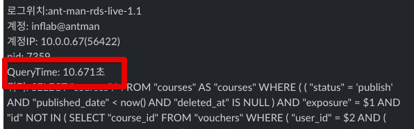
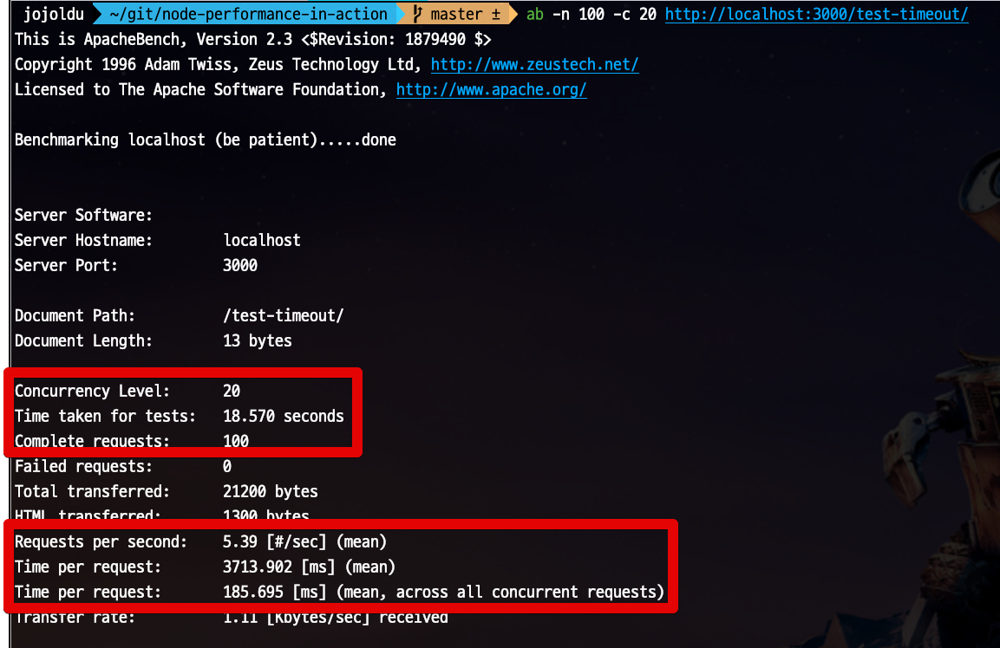
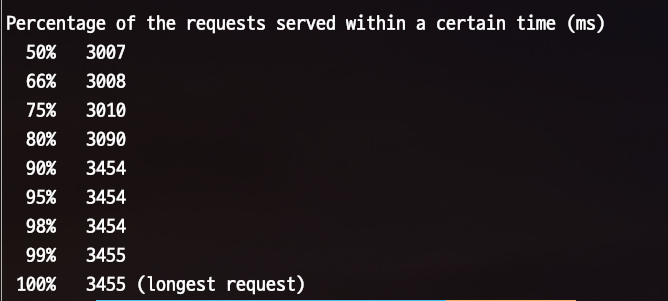
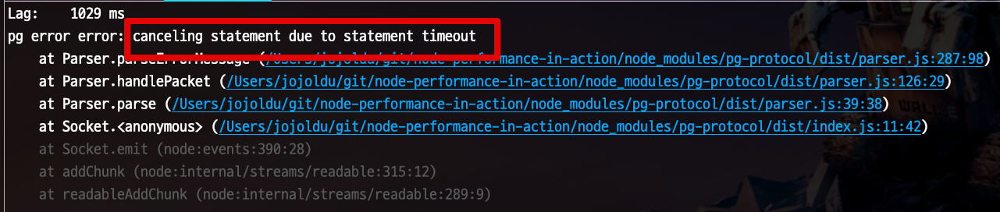

# NodeJS 와 PostgreSQL Query Timeout

작은 서비스를 운영할때는 문제가 없던 서비스가 데이터가 적재되면 될수록 점점 슬로우 쿼리가 등장하게 됩니다.  



이때 쿼리 시간을 제한하지 않으면, **5분/10분씩 수행되는 쿼리가 운영 환경에서 실행**하게 되기도 하는데요.  
  
이런 쿼리가 트래픽에 맞춰 여러개 요청이 온다면 결국 Node에서 사용가능한 Connection Pool이 가득차 더이상 쿼리 질의를 못하거나, 심한 경우 데이터베이스의 장애로 서비스가 사용불가능하게 되기도 합니다.  
  
그래서 **적정시간 이상으로 쿼리가 수행되면 강제로 종료**하고, 다시 요청하도록 하는것이 일반적인 방식인데요.  
해당 상황과 PostgreSQL에서의 옵션에 대해 소개드립니다.

## 1. 실험 환경

실험의 경우 아래 환경에서 진행합니다.

* Node 16
* PostgreSQL 14 (by Docker)

간단하게 아래와 같이 Node와 PG를 사용한 코드를 하나 만들어둡니다.

> lint 등을 빼고 실험을 위해 빠르게 구성했습니다.

**app.ts**

```javascript
const express = require('express');
const pg = require('pg');

const app = express()
const port = 3000

const client = new pg.Pool({
  host: 'localhost',
  user: 'test',
  password: 'test',
  database: 'test',
  port: 5432,
  min: 5,
  max: 50,
})

client.connect(err => {
  if (err) {
    console.log('Failed to connect db ' + err)
  } else {
    console.log('Connect to db done!')
  }
})

app.get('/', (req, res) => {
  res.send('Hello World!')
});

app.get('/test-timeout', async (req, res) => {
  const start = new Date();
  try {
    await client.query('SELECT pg_sleep(3);');
    const lag = new Date() - start;
    console.log(`Lag: \t${lag} ms`);
  } catch (e) {
    const lag = new Date() - start;
    console.log(`Lag: \t${lag} ms`);
    console.error('pg error', e);
  }

  res.send('test-timeout!');
});

app.listen(port, () => {
  console.log(`Example app listening at http://localhost:${port}`)
});
```

> 모든 코드는 [Github](https://github.com/jojoldu/node-performance-in-action)에 있습니다.

아주 간단한 코드입니다.

* API 호출시 강제로 3초의 쿼리를 발생시키고 (`await client.query('SELECT pg_sleep(3);');`)
* 실제로 3초의 시간만 수행 되었는지 로그로 출력 (`const lag = new Date() - start;`)

## 2. 테스트

일정 트래픽을 몰아주기 위해서 테스트는 [Apache Bench](https://httpd.apache.org/docs/2.4/ko/programs/ab.html) 를 통해 진행합니다.

> **Mac**을 사용하는 경우엔 ApacheBench 가 기본적으로 설치되어있습니다.  
> 설치여부를 확인하기 위해서 `ab -v` 로 확인해보면 됩니다.

Node와 PostgreSQL (Docker)를 실행한 뒤, 아래명령어를 터미널에 입력합니다.

```bash
ab -n 100 -c 20 http://localhost:3000/test-timeout/
```

* `-n 100`
  * 총 요청 횟수입니다.
  * 요청 사용자들이 다합쳐서 보낼 회수입니다.
* `-c 20`
  * 총 요청자들의 수 입니다.
  * 20명의 동시 사용자가 요청합니다.

이렇게 요청하시면 다음과 같은 결과를 얻을 수 있습니다.



<br/><br/>



* 이 테스트는 **20명의 동시 사용자로 총 100번을 호출**했다는 것을 의미합니다
* 요청당 평균 시간
  * `Time per request` 의 첫번째 값
  * 이 요청은 3713 ms, 즉 평균 3.7초 
* 예상되는 평균 응답시간
  * `Percentage of the requests served...` 항목
  * 3007ms ~ 3455ms 로 응답
* 초당 요청
  * `Request per second` 항목
  * **1초에 최대 요청양**을 이야기한다.
  * 현재 5.39 인데, 이는 **1초에 5건을 처리할 수 있다**는 것을 의미

순식간에 100개의 요청을 보냈지만, **Connection 수의 제한**으로 초당 5건밖에 처리하지 못했는데요.  
  
만약 지연되는 쿼리가 3초가 아니라 60초, 600초였다면 **그 시간동안 지정된 Max Connection이 가득차** 더이상 Database에 쿼리를 날릴수가 없는 상태가 됩니다.   
  
이런 문제를 해결하려면 어떻게 해야할까요?

## 3. statement_timeout

PostgreSQL에서는 QueryTimeout 옵션을 `statement_timeout` 으로 설정할 수 있습니다.  
해당 옵션을 지정하면 **지정된 시간이 지나도록 끝나지 않은 쿼리는 강제 종료**시킵니다.  
  
Express와 `pg` 모듈만 사용중이시라면 아래와 같이 connection Option에서 설정할 수 있습니다.

```javascript
const client = new pg.Pool({
  statement_timeout: 1000,
})
```

만약 **TypeORM을 사용**하신다면, 아래와 같이 `extra` 항목에 추가해서 설정할 수 있습니다.

```javascript
  return TypeOrmModule.forRoot({
    maxQueryExecutionTime: dbEnv.connectionTimeout,
    extra: {
      statement_timeout: dbEnv.connectionTimeout,
      ...
    },
    ...
  });
```

* `maxQueryExecutionTime` 는 **타임아웃 설정이 아닙니다**
  * [공식문서](https://github.com/typeorm/typeorm/blob/master/docs/logging.md#log-long-running-queries) 에 나와있듯이, **이 시간이 지나면 롱쿼리 로그를 남기겠다**의 옵션입니다.
  * 오해하시면 안되며, 타임아웃 설정은 `extra.statement_timeout` 로 하셔야 합니다.

## 4. 타임아웃 테스트

해당 옵션을 적용하고 다시 테스트를 진행해보면 다음과 같이 **1초만 지나도 바로 쿼리가 취소**되는 것을 확인할 수 있습니다.




위와 같이 설정한다면 다음의 장점을 얻게 됩니다.

* (우리 서비스의 평균응답시간을 알고 있다면) 그 이상이 소요되는 예외상황들은 차라리 빨리 취소시켜 **전체 서비스의 장애로 확장되는 것을 미연에 방지**할 수 있게 됩니다.

