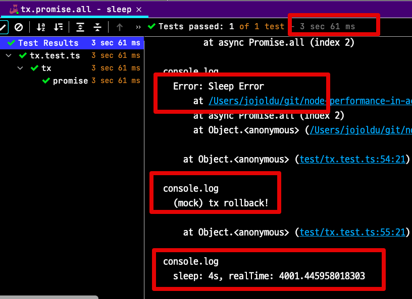

# Promise.all & Transactions (feat. Node.js)

최근 팀에서 코드리뷰를 진행하던 중에 `promise.all` 과 트랜잭션에 대해 오해하고 있는 부분들을 발견하게 되어 정리하게 되었습니다.  
  
Promise.all (혹은 allSettled)을 사용하면 트랜잭션 내에서도 비동기로 여러 작업들이 동시에 이루어질 수 있다고 오해하는 것인데요.  
실험을 해보면 그게 아니라는 것을 알 수 있습니다.  
  
실제 코드를 가지고 검증해보겠습니다.

> 모든 실험 결과에 대해서 틀린 내용이 있다면 바로 댓글로 지적해주세요!  
> 모든 지적은 저의 성장에 많은 도움이 되기 때문에 감사한 마음으로 수정하겠습니다 :) 

## 0. 테스트 환경

테스트할 환경은 다음과 같습니다.

* Node.js 16.3.1
* PostgreSQL 13.2

> 모든 코드는 [Github](https://github.com/jojoldu/node-performance-in-action) 에 있습니다.

## 1. Promise.all

먼저 `promise.all` 에 대해서 알아보겠습니다.  
(이미 아시겠지만, 이후 테스트를 설명하기 위한 배경 설명으로 봐주시면 됩니다.)  

테스트를 위해 다음과 같이 2개의 함수를 만들겠습니다.

```ts
export function sleep(sec) {
    const start = performance.now();
    return new Promise(resolve=>{
        setTimeout(resolve, sec * 1000);
    }).then(() => {
        console.log(`sleep: ${sec}s, realTime: ${performance.now()- start}`);
    });
}

export function sleepThrow(sec) {
    const start = performance.now();
    return new Promise(resolve=>{
        setTimeout(resolve, sec * 1000);
    }).then(() => {
        console.log(`sleep & Throw: ${sec}s, realTime: ${performance.now()- start}`);
        throw new Error('Sleep Error');
    })
}
```

지정된 시간 만큼 대기하는 함수 `sleep()` 과 지정된 시간만큼 대기한 뒤에 Error를 뱉는 `sleepThrow()` 가 있습니다.  
  
이들을 사용한 아래 코드의 실행 결과를 예상해보겠습니다.

```ts
it('promise.all - sleep', async () => {
    try {
        await Promise.all([
            sleep(1),
            sleep(2),
            sleepThrow(3),
            sleep(4),
        ]);
    } catch (e) {
        console.log(e);
        console.log('(mock) tx rollback!');
    }
});
```

아마도 `sleepThrow(3)` 로 인해서 `sleep(4)` 가 정상적으로 종료되지 않았을거라고 생각하시는 분들은 없을 것입니다.  
  
실제 결과를 보면 다음과 같습니다.

```js
sleep: 1s, realTime: 1002.1712079942226

sleep: 2s, realTime: 2002.135666012764

sleep & Throw: 3s, realTime: 3001.1547079980373
Error: Sleep Error
    at /Users/jojoldu/git/node-performance-in-action/src/sleep.ts:18:15
    at async Promise.all (index 2)
    at Object.<anonymous> (/Users/jojoldu/git/node-performance-in-action/test/tx.test.ts:47:13)

    at Object.<anonymous> (test/tx.test.ts:54:21)


(mock) tx rollback!

sleep: 4s, realTime: 4001.101915985346
```



로그를 보시면 다음을 알 수 있습니다.

* 총 수행시간은 3초인것을 보면 `sleepThrow(3)` 에서 바로 `promise.all` 은 reject로 바로 빠져나온 것을 알 수 있습니다.
* 반면 `catch` 에 해당하는 `(mock) tx rollback!` 가 호출되었지만 `sleep(4)` 도 정상적으로 종료되었음을 알 수 있습니다.
  * 이는 `promise.all` 은 이미 진행중인 `Promise` 들을 강제로 종료하는게 아니라 계속 실행되지만 결과가 무시되기 때문입니다.

이 쿼리가 `select`가 아니라 `insert` 라고 가정해보면,

* 1~3번째까지 데이터가 등록되던 중에 3번째에서 실패가 나서 트랜잭션 롤백 (`catch` 에서 `ROLLBACK` 실행)
* 4번째 쿼리는 롤백 대상에 포함되지 않고 `insert` 되는 상황 발생

을 예상할 수 있습니다.   
그래서 **전체 결과가 트랜잭션 범위 내에서 롤백** 해야 하는 경우엔 **전체의 결과를 지켜보고 판단**할 수 있도록 `promise.allSettled()` 을 사용하는데요.  
  
바로 다음의 코드를 확인해봅니다.

```ts
it('promise.allSettled - sleep', async () => {
    const result = await Promise.allSettled([
        sleep(1),
        sleep(2),
        sleepThrow(3),
        sleep(4),
    ]);

    console.log(result.map(r => r.status));
    console.log('test finish!');
});
```

이를 수행해보면 다음과 같이 예상한대로 `sleep(4)` 도 결과를 확인할 수 있음을 알 수 있습니다.

```js
sleep: 1s, realTime: 1000.9564159810543

sleep: 2s, realTime: 2001.6974580287933

sleep & Throw: 3s, realTime: 3001.664959013462

sleep: 4s, realTime: 4000.793624997139

[ 'fulfilled', 'fulfilled', 'rejected', 'fulfilled' ]

test finish!
```


* 실제로 수행시간이 앞선것과 달리 4초가 수행되었음을 알 수 있습니다.

자 그럼 트랜잭션도 `allSettled` 을 쓰면 해결되는 것일까요?

## 2. Promise.all & Transaction

이번에는 실제로 **1초 ~ 5초동안 수행되는 insert 쿼리**들로 테스트를 해보겠습니다.  
  
모든 테스트에 공통으로 사용할 `sleep & insert` 함수는 다음과 같습니다.

```ts
export async function insert(sec: number, failNumber: number, funcName: string, client?: PoolClient) {
    const start = performance.now();
    const sql = `insert into node_test (name, sleep)
                 values (\'${funcName}-${sec}\', pg_sleep(${sec}))`;

    const connection = client ? client : await pool.connect();
    return connection.query(sql)
        .then((result) => {
            console.log(`insert: ${sec}s, realTime: ${performance.now()- start}`);
            return result;
        });
}

export async function insertThrow(sec: number, failNumber: number, funcName: string, client?: PoolClient) {
    // 오류나는 쿼리
    const sql = `insert into node_test (name, sleep, throw)
                 values (\'${funcName}-${sec}\', pg_sleep(${sec}))`;

    // 커넥션을 재사용할지 새로 만들지 선택합니다.
    const connection = client ? client : await pool.connect();
    return connection.query(sql);
}
```


### Promise.allSettled & 단일 커넥션

가장 먼저 테스트해볼 것은 `promise.allSettled` 과 **트랜잭션에서 사용하는 커넥션을 재사용한 경우**입니다.  
  
바로 위 챕터인 `1. Promise.all` 을 생각해보면 이 기능은 **비동기로 처리가 되다가 전체 트랜잭션 롤백**이 되어야만 하는데요.

```ts
export async function insertAllWithPoolAndAllSettled() {
    const client = await pool.connect();
    const funcName = 'insertAllWithPoolAndAllSettled'
    try {
        await client.query('BEGIN');

        const result = await Promise.allSettled([
            insert(1, funcName, client),
            insert(2, funcName, client),
            insert(3, funcName, client),
            insertThrow(4, funcName, client),
            insert(5, funcName, client)
        ]);

        if (result.filter(r => r.status === 'rejected').length > 0) {
            throw new Error('Promise.allSettled exist Error');
        }

        await commit(client);
    } catch (error) {
        console.log('tx rollback', error);
        await rollback(client);
    } finally {
        await client.release();
    }
}
```

위 코드를 테스트 코드로 실행해봅니다.

```ts
it('[promise.allSettled & pool 재사용 O] connection 사용을 위해 대기하고, 데이터 롤백 된다', async () => {
    await insertAllWithPoolAndAllSettled();

    const result = await selectAll();

    console.log(result.map(r => r.name));
    expect(result.length).toBe(0);

}, 60000);
```

그럼 결과는 어떻게 나올까요?


**총 수행시간이 6초** (1초 + 2초 + 3초) 가 나오며 롤백 되었습니다.  

* 정상적인 비동기가 수행되었다면 **3초**에서 롤백이 되었어야 합니다.
* 하지만 `insert(1)`, `insert(2)`, `insert(3)` 가 **모두 순차적으로 수행**되었을때 나올 6초가 총 수행시간이 되었습니다.
* 즉, **Promise.allSettled을 쓰더라도 단일 커넥션을 재사용할때는 순차적으로 수행**된다는 것을 알 수 있습니다.

이는 당연하게도 **데이터베이스의 커넥션은 비동기로 작동하지 않기 때문**입니다.  
하나의 커넥션은 일을 처리하는 동안은 다른 일을 처리할 수 없고, Promise 객체는 커넥션을 사용할때까지 큐에 대기할 수밖에 없습니다.

### Promise.all & 단일 커넥션

그럼 `Promise.all` 은 다를까요?

```ts
export async function insertAllWithPool() {
    const client = await pool.connect();
    const funcName = 'insertAllWithPool'
    try {
        await client.query('BEGIN');

        await Promise.all([
            insert(1, funcName, client),
            insert(2, funcName, client),
            insert(3, funcName, client),
            insertThrow(4, funcName, client),
            insert(5, funcName, client)
        ]);

        await commit(client);
    } catch (error) {
        console.log('tx rollback', error);
        await rollback(client);
    } finally {
        await client.release();
    }
}
```

바로 테스트 코드로 수행해봅니다.

```ts
it('[promise.all & pool 재사용 O] connection 사용을 위해 대기하고, 데이터 롤백 된다', async () => {
    await insertAllWithPool();

    const result = await selectAll();

    console.log(result.map(r => r.name));
    expect(result.length).toBe(0);

}, 60000);
```

Promise.all도 마찬가지로 **순차적으로 커넥션을 할당 받을때까지 대기** 하는 것을 확인할 수 있습니다.


**단일 커넥션을 재사용하기 위해서**는 `Promise.allSettled`, `Promise.all` 모두 커넥션을 할당받을때까지 대기할 수 밖에 없습니다.  
즉, **원하던대로 비동기로 작동하는 트랜잭션**처리는 할 수 없었습니다.

### Promise.allSettled & 개별 커넥션

자 그럼, **각 쿼리마다 개별 커넥션**을 사용한다면 어떨까요?

```ts
export async function insertAllWithAllSettled() {
    const client = await pool.connect();
    const funName = 'insertAllWithAllSettled'
    try {
        await client.query('BEGIN');

        const result = await Promise.allSettled([
            insert(1, failNumber, funName),
            insert(2, failNumber, funName),
            insertThrow(3, failNumber, funName),
            insert(4, failNumber, funName),
        ]);

        if (result.filter(r => r.status === 'rejected').length > 0) {
            throw new Error('Promise.allSettled exist Error');
        }

        await commit(client);
    } catch (error) {
        console.log('tx rollback', error);
        await rollback(client);
    } finally {
        await client.release();
    }
}
```

위 코드는 모두 **트랜잭션에서 사용한 커넥션과는 별개로** 커넥션을 생성해서 `insert`를 처리합니다.  
  
이를 테스트 해본다면?

```ts
it('[promise.allSettled & pool 재사용 X] 다른 promise들의 결과를 다 수신해서 실패처리하지만, 데이터 롤백은 되지 않는다', async () => {
    await insertAllWithAllSettled();

    const result = await selectAll();

    expect(result.length).toBe(0);

}, 60000);
```


* 비동기로 5초만에 모든 작업이 수행된 것을 볼 수 있습니다.
* 다만, **롤백이 정상적으로 수행되지 않았습니다**

이는 당연한 일인데요.  
**트랜잭션 롤백 자체가 해당 커넥션에서 이루어진 작업들을 롤백**하는 것을 의미합니다.  
그렇기 때문에 다른 커넥션에서 이루어진 작업에 대해 롤백을 할 수가 없습니다.  
  
즉, 개별커넥션을 사용해서 롤백을 구현해야한다면 **해당 커넥션들 모두에 롤백 명령을 내려야만 합니다**.

## 3. 마무리

위 실험을 통해 다음의 결과를 얻을 수 있습니다.

* `Promise.all()` 을 사용하고 실패한다고 해서 아직 끝나지 않은 Promise가 강제 종료되진 않는다.
  * 단지 결과를 무시할 뿐이기 때문에 이미 실행된 작업들은 모두 정상 완료까지 진행된다.
* `Promise.allSettled()` 를 사용하면 전체의 결과를 다 수집할때까지 기다린다.
  * 이를 통해 **후처리에 반영되지 않는 Promise 작업**들을 다 포함시킬 수 있다.
* 트랜잭션 Commit / Rollback을 위해서는 단일 커넥션 안에서 이루어져야 한다.
* 단일 커넥션을 사용한다면, 커넥션을 사용할 때까지 대기를 해야되기 때문에 `Promise.all(allSettled)`를 사용하더라도 **비동기로 작업을 처리할 수가 없다**. 
* 개별 커넥션을 사용하면 비동기와 트랜잭션의 관계가 가능하지만, **Promise 수만큼 커넥션 롤백 명령을 내려야만한다**.
  * 코드 복잡도가 너무 높아지기 때문에 성능 튜닝이 필요한게 아니라면 주의가 필요하다.

위 내용을 한 문장으로 정리하면, `for`문으로 작업하나 `Promise.all(allSettled)`로 작업하나 **데이터베이스의 단일 커넥션을 사용할때는 똑같은 순차 작업**이 될 뿐이라는 것입니다.  
  
다음 실험에서는 **일부의 Promise는 API통신 등 데이터베이스가 아닌 작업들이 포함된 경우**에 어떻게 되는지 알아보겠습니다.

> 모든 실험 결과에 대해서 틀린 내용이 있다면 바로 댓글로 지적해주세요!  
